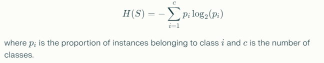
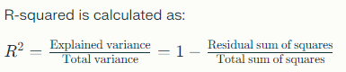

# Machine Learning Interview Questions:

## 1. What is the difference between supervised and unsupervised learning?

Supervised learning and unsupervised learning are two fundamental approaches in machine learning. 

- **Supervised Learning** involves training a model on a labeled dataset, meaning that each training example is paired with an output label. The model learns to map inputs to outputs, allowing it to make predictions on new, unseen data. Common examples include classification and regression tasks.

- **Unsupervised Learning**, on the other hand, deals with datasets that do not have labeled outputs. The model tries to find hidden patterns or intrinsic structures in the data. Clustering and dimensionality reduction are typical tasks in this category. 

In summary, the key difference lies in the presence of labeled data: supervised learning uses it, while unsupervised learning does not.

## 2. Can you explain the concept of overfitting and underfitting in machine learning models?

Certainly! 

- **Overfitting** occurs when a model learns the training data too well, capturing noise and outliers rather than the underlying pattern. This results in high accuracy on the training set but poor performance on unseen data because the model is too complex.

- **Underfitting**, conversely, happens when a model is too simple to capture the underlying trend of the data. This leads to poor performance on both the training and test datasets. 

The goal is to find a balance between these two extremes, often achieved through techniques like regularization, cross-validation, and selecting appropriate model complexity.

## 3. What is cross-validation? Why is it important?

Cross-validation is a statistical method used to estimate the skill of machine learning models. It involves partitioning the dataset into subsets, training the model on some subsets (the training set) and validating it on the remaining subsets (the validation set). 

The most common form is k-fold cross-validation, where the dataset is divided into k subsets. The model is trained k times, each time using a different subset as the validation set while the remaining k-1 subsets form the training set.

Cross-validation is important because it helps ensure that the model generalizes well to unseen data, reduces the risk of overfitting, and provides a more reliable estimate of model performance.

## 4. Describe how a decision tree works. When would you use it over other algorithms?

A decision tree is a flowchart-like structure used for classification and regression tasks. It splits the dataset into branches based on feature values, leading to decision nodes and leaf nodes. 

1. **Splitting**: The algorithm selects the best feature to split the data at each node based on criteria like Gini impurity or information gain.
2. **Decision Nodes**: Each internal node represents a feature, and each branch represents a decision rule.
3. **Leaf Nodes**: The end points represent the predicted output.

Decision trees are particularly useful when interpretability is crucial, as they provide clear rules for decision-making. They also handle both numerical and categorical data well. However, they can be prone to overfitting, so techniques like pruning or ensemble methods (e.g., Random Forest) are often employed.

## 5. How do you handle missing or corrupted data in a dataset?

Handling missing or corrupted data is a critical step in data preprocessing. Here are several strategies:

1. **Imputation**: Replace missing values with statistical measures like the mean, median, or mode. For categorical variables, you might use the most frequent category.
2. **Deletion**: Remove records with missing values, though this can lead to loss of valuable data.
3. **Prediction**: Use machine learning algorithms to predict and fill in missing values based on other features.
4. **Flagging**: Create a new feature to indicate whether a value was missing, which can sometimes provide useful information.

The choice of method depends on the extent and nature of the missing data, as well as the specific analysis goals.

## 6. What is the bias-variance tradeoff?

The bias-variance tradeoff is a fundamental concept in machine learning that describes the balance between two types of errors:

- **Bias** refers to the error due to overly simplistic assumptions in the learning algorithm. High bias can lead to underfitting, where the model fails to capture the underlying trend of the data.

- **Variance** refers to the error due to excessive complexity in the learning algorithm. High variance can lead to overfitting, where the model learns noise in the training data rather than the actual signal.

The tradeoff is crucial because a model with low bias might have high variance and vice versa. The goal is to find a model that achieves a good balance, minimizing both types of error.

## 7. What is the difference between bagging and boosting?

Bagging and boosting are both ensemble learning techniques that combine multiple models to improve performance, but they differ in their approaches:

- **Bagging** (Bootstrap Aggregating) involves training multiple models independently on random subsets of the training data and then averaging their predictions (for regression) or taking a majority vote (for classification). This method helps reduce variance and is effective in preventing overfitting. Random Forest is a popular bagging algorithm.

- **Boosting**, on the other hand, trains models sequentially. Each new model focuses on correcting the errors made by the previous ones. The final prediction is a weighted sum of the predictions from all models. Boosting can significantly reduce both bias and variance but is more prone to overfitting if not carefully managed. AdaBoost and Gradient Boosting are common boosting algorithms.

## 8. How would you validate a model you created to generate a predictive analysis?

To validate a predictive model, I would follow a systematic approach:

1. **Train-Test Split**: Divide the dataset into a training set and a test set (commonly 70-80% for training and 20-30% for testing).
2. **Cross-Validation**: Implement k-fold cross-validation to assess the model's performance on different subsets of the data, ensuring robustness.
3. **Performance Metrics**: Choose appropriate metrics based on the problem type, such as accuracy, precision, recall, F1-score for classification, and RMSE or R-squared for regression.
4. **Confusion Matrix**: For classification tasks, analyze the confusion matrix to understand the model's performance across different classes.
5. **Hyperparameter Tuning**: Use techniques like grid search or random search to optimize model parameters and improve performance.
6. **Validation on Unseen Data**: Finally, test the model on a completely unseen dataset to evaluate its generalization ability.

## 9. Can you explain the principle of a support vector machine (SVM)?

A Support Vector Machine (SVM) is a supervised learning algorithm primarily used for classification tasks. The core idea is to find a hyperplane that best separates different classes in the feature space. 

1. **Maximizing Margin**: SVM aims to maximize the margin, which is the distance between the hyperplane and the nearest data points from each class (these points are called support vectors).
2. **Kernel Trick**: SVM can handle non-linearly separable data by applying a kernel function, which transforms the input space into a higher-dimensional space where a hyperplane can effectively separate the classes.
3. **Regularization**: SVM includes a regularization parameter to control the trade-off between maximizing the margin and minimizing classification errors.

SVM is particularly effective in high-dimensional spaces and is robust to overfitting, especially in cases where the number of dimensions exceeds the number of samples.

## 10. What are some of the advantages and disadvantages of a neural network?

Neural networks have several advantages and disadvantages:

### Advantages:
- **Flexibility**: They can model complex relationships and patterns in data, making them suitable for a wide range of tasks, including image and speech recognition.
- **Scalability**: Neural networks can handle large datasets and benefit from increased data and computational power.
- **Feature Learning**: They can automatically learn relevant features from raw data, reducing the need for manual feature engineering.

### Disadvantages:
- **Data Hungry**: Neural networks typically require large amounts of labeled data to perform well.
- **Computationally Intensive**: Training deep neural networks can be resource-intensive, requiring significant computational power and time.
- **Black Box Nature**: They often lack interpretability, making it challenging to understand how decisions are made.

## 11. How does the k-means algorithm work?

The k-means algorithm is a popular clustering technique used to partition a dataset into k distinct clusters. Here’s how it works:

1. **Initialization**: Select k initial centroids randomly from the dataset.
2. **Assignment Step**: Assign each data point to the nearest centroid, forming k clusters.
3. **Update Step**: Recalculate the centroids by taking the mean of all data points assigned to each cluster.
4. **Iteration**: Repeat the assignment and update steps until the centroids no longer change significantly or a predefined number of iterations is reached.

K-means is efficient and simple but requires the number of clusters (k) to be specified in advance and can be sensitive to the initial placement of centroids.

## 12. Can you explain the difference between L1 and L2 regularization methods?

L1 and L2 regularization are techniques used to prevent overfitting in machine learning models by adding a penalty term to the loss function.

- **L1 Regularization** (Lasso Regression): Adds the absolute value of the coefficients as a penalty term. This can lead to sparse solutions, where some coefficients are exactly zero, effectively performing feature selection.

- **L2 Regularization** (Ridge Regression): Adds the square of the coefficients as a penalty term. This discourages large coefficients but does not lead to sparse solutions. Instead, it shrinks all coefficients evenly.

In summary, L1 regularization can produce simpler models with fewer features, while L2 regularization tends to distribute the weight across all features, which can be beneficial when all features are relevant.

## 13. What is principal component analysis (PCA) and when is it used?

Principal Component Analysis (PCA) is a dimensionality reduction technique used to transform a high-dimensional dataset into a lower-dimensional space while retaining as much variance as possible. 

1. **Feature Extraction**: PCA identifies the directions (principal components) in which the data varies the most.
2. **Projection**: The original data is then projected onto these principal components, reducing the number of dimensions.

PCA is commonly used for data visualization, noise reduction, and as a preprocessing step before applying other machine learning algorithms, especially when dealing with high-dimensional data.

## 14. Can you describe what an activation function is and why it is used in an artificial neural network?

An activation function is a mathematical function applied to the output of each neuron in an artificial neural network. Its primary purpose is to introduce non-linearity into the model, enabling the network to learn complex patterns.

### Common Activation Functions:
- **Sigmoid**: Maps input values to a range between 0 and 1, often used in binary classification.
- **ReLU (Rectified Linear Unit)**: Outputs the input directly if positive; otherwise, it outputs zero. It helps mitigate the vanishing gradient problem.
- **Softmax**: Converts raw scores into probabilities for multi-class classification tasks.

By using activation functions, neural networks can approximate a wide variety of functions, making them powerful tools for complex tasks.

## 15. How would you handle an imbalanced dataset?

Handling an imbalanced dataset is crucial to ensure that the model performs well across all classes. Here are several strategies:

1. **Resampling Techniques**:
   - **Oversampling**: Increase the number of instances in the minority class by duplicating or generating synthetic samples (e.g., using SMOTE).
   - **Undersampling**: Reduce the number of instances in the majority class to balance the classes.

2. **Use Different Metrics**: Instead of accuracy, focus on metrics like precision, recall, F1-score, or AUC-ROC that provide better insights into model performance on imbalanced data.

3. **Cost-sensitive Learning**: Modify the learning algorithm to penalize misclassifications of the minority class more than the majority class.

4. **Ensemble Methods**: Use ensemble techniques like bagging and boosting that can help improve performance on imbalanced datasets.

By employing these strategies, you can create models that are more robust and effective in dealing with class imbalances.

## 16. Can you explain the concept of "feature selection" in machine learning?

Feature selection is the process of identifying and selecting a subset of relevant features (variables, predictors) for use in model construction. The main goals are to enhance model performance, reduce overfitting, and improve interpretability.

### Methods of Feature Selection:
1. **Filter Methods**: Evaluate the relevance of features based on statistical tests (e.g., chi-squared test, correlation coefficients) without involving any machine learning model.
2. **Wrapper Methods**: Use a specific machine learning algorithm to evaluate the performance of different feature subsets (e.g., recursive feature elimination).
3. **Embedded Methods**: Perform feature selection as part of the model training process (e.g., Lasso regression).

Effective feature selection can lead to simpler models, faster training times, and improved accuracy.

## 17. What is the difference between stochastic gradient descent (SGD) and batch gradient descent?

Stochastic Gradient Descent (SGD) and Batch Gradient Descent are both optimization algorithms used to minimize the loss function in machine learning models, but they differ in their approach:

- **Batch Gradient Descent** computes the gradient of the loss function using the entire training dataset. While it provides a stable estimate of the gradient, it can be computationally expensive and slow, especially with large datasets.

- **Stochastic Gradient Descent**, on the other hand, updates the model parameters using only one training example at a time. This makes it much faster and allows the model to start improving immediately. However, the updates can be noisy and may lead to fluctuations in the convergence path.

In practice, a mini-batch gradient descent approach is often used, which combines the benefits of both methods by updating the model using small batches of data.

## 18. Can you describe how a convolutional neural network (CNN) works?

A Convolutional Neural Network (CNN) is a specialized type of neural network designed for processing structured grid data, such as images. Here’s how it works:

1. **Convolutional Layers**: These layers apply convolution operations to the input, using filters (kernels) to detect local patterns (e.g., edges, textures). The output is a feature map that highlights the presence of specific features.

2. **Activation Function**: After convolution, an activation function (commonly ReLU) is applied to introduce non-linearity.

3. **Pooling Layers**: These layers downsample the feature maps, reducing their dimensionality while retaining important information. Max pooling is a common technique used for this purpose.

4. **Fully Connected Layers**: The final layers are fully connected layers that take the high-level features and make predictions based on them.

CNNs are particularly effective for image classification, object detection, and other tasks involving spatial hierarchies, thanks to their ability to learn spatial hierarchies of features.

## 19. How do you handle categorical variables in your dataset?

Handling categorical variables is essential for effective model training. Here are some common techniques:

1. **Label Encoding**: Assigns a unique integer to each category. This method is suitable for ordinal categorical variables where the order matters.

2. **One-Hot Encoding**: Creates binary columns for each category, indicating the presence or absence of a category. This method is ideal for nominal categorical variables where no order exists.

3. **Target Encoding**: Replaces categories with the mean of the target variable for that category. This method can be useful but may lead to overfitting if not handled carefully.

4. **Frequency Encoding**: Replaces categories with their frequency in the dataset. This can provide useful information while maintaining simplicity.

The choice of method depends on the nature of the categorical variable and the specific requirements of the machine learning algorithm being used.

## 20. What is reinforcement learning? Can you give an example of where it could be used?

Reinforcement Learning (RL) is a type of machine learning where an agent learns to make decisions by interacting with an environment. The agent receives feedback in the form of rewards or penalties based on its actions, allowing it to learn optimal behavior over time.

### Example Use Case:
A classic example of reinforcement learning is training an agent to play a video game. The agent receives rewards for achieving certain objectives (like scoring points) and penalties for failing (like losing a life). Through trial and error, the agent learns which actions lead to the highest cumulative reward, improving its strategy over time.

Reinforcement learning is widely used in various applications, including robotics, autonomous vehicles, recommendation systems, and game playing (e.g., AlphaGo).

---

## 21. Describe a situation where you had to handle missing data. What techniques did you use?

In a recent project involving customer data analysis, I encountered a dataset with missing values in several key features, such as age and income. To handle this missing data, I employed a combination of techniques:

1. **Exploratory Data Analysis (EDA)**: First, I assessed the extent of the missing data to understand its impact on the analysis. This included visualizing the distribution of missing values.

2. **Imputation**: For the age feature, which had a relatively small number of missing values, I used mean imputation, replacing missing values with the average age of the dataset. For income, which had a larger proportion of missing values, I opted for median imputation to reduce the influence of outliers.

3. **Flagging**: I created a new binary feature indicating whether the income value was missing. This allowed the model to capture any potential patterns related to missingness.

4. **Model Evaluation**: After imputation, I validated the model's performance using cross-validation to ensure that the imputation method did not introduce bias.

By combining these techniques, I was able to maintain the integrity of the dataset and improve the model's predictive power.

## 22. How would you evaluate a machine learning model's performance?

Evaluating a machine learning model's performance involves several key steps:

1. **Train-Test Split**: I would first split the dataset into training and testing sets to assess how well the model generalizes to unseen data.

2. **Performance Metrics**: Depending on the problem type, I would select appropriate metrics:
   - For **classification tasks**, I would use accuracy, precision, recall, F1-score, and the ROC-AUC score.
   - For **regression tasks**, I would consider metrics like Mean Absolute Error (MAE), Mean Squared Error (MSE), and R-squared.

3. **Confusion Matrix**: For classification models, I would analyze the confusion matrix to understand the distribution of true positives, false positives, true negatives, and false negatives.

4. **Cross-Validation**: Implementing k-fold cross-validation would provide a more robust estimate of model performance by evaluating it on multiple subsets of the data.

5. **Learning Curves**: I would plot learning curves to visualize how the model performs with varying amounts of training data, helping to identify issues like overfitting or underfitting.

By using these methods, I can comprehensively evaluate the model's performance and make informed decisions for improvement.

## 23. Which metrics would you use for binary classification? How about for multi-class classification or regression?

### Binary Classification Metrics:
1. **Accuracy**: The ratio of correctly predicted instances to the total instances.
2. **Precision**: The ratio of true positives to the sum of true positives and false positives, indicating the quality of positive predictions.
3. **Recall (Sensitivity)**: The ratio of true positives to the sum of true positives and false negatives, showing the model's ability to identify positive instances.
4. **F1-Score**: The harmonic mean of precision and recall, providing a balance between the two.
5. **ROC-AUC**: The area under the Receiver Operating Characteristic curve, measuring the model's ability to discriminate between classes.

### Multi-Class Classification Metrics:
1. **Accuracy**: Similar to binary classification, but calculated across all classes.
2. **Macro F1-Score**: The average F1-score across all classes, treating each class equally.
3. **Micro F1-Score**: The F1-score calculated globally by counting the total true positives, false negatives, and false positives.
4. **Confusion Matrix**: A matrix that shows the performance of the model across all classes.

### Regression Metrics:
1. **Mean Absolute Error (MAE)**: The average absolute difference between predicted and actual values.
2. **Mean Squared Error (MSE)**: The average of the squares of the differences between predicted and actual values, penalizing larger errors more heavily.
3. **R-squared**: The proportion of variance in the dependent variable that can be explained by the independent variables.

Choosing the right metrics depends on the specific goals of the analysis and the nature of the data.

## 24. Describe a scenario where you chose one algorithm over another based on its performance characteristics.

In a project aimed at predicting customer churn, I had to choose between a logistic regression model and a random forest classifier. 

### Performance Characteristics Considered:
1. **Interpretability**: Logistic regression provides a clear understanding of the impact of each feature on the prediction, which was important for stakeholders.
2. **Complexity**: The random forest model, while potentially more accurate due to its ensemble nature, was more complex and less interpretable.
3. **Data Size**: Given the dataset was relatively small, logistic regression was less likely to overfit compared to the random forest model.

After evaluating both models using cross-validation, I found that logistic regression performed comparably to the random forest in terms of accuracy while providing better interpretability. Thus, I chose logistic regression for this particular use case, aligning with the project's needs for transparency and simplicity.

## 25. How do you handle categorical variables when preparing data for machine learning?

Handling categorical variables is crucial for effective model training. Here are the steps I typically follow:

1. **Identify Categorical Variables**: First, I identify which features are categorical and determine whether they are ordinal (with a meaningful order) or nominal (without an inherent order).

2. **Encoding Techniques**:
   - **Label Encoding**: For ordinal variables, I assign integer values that reflect the order of categories.
   - **One-Hot Encoding**: For nominal variables, I create binary columns for each category, indicating the presence or absence of that category. This prevents the model from assuming any ordinal relationship between categories.

3. **Handling High Cardinality**: For categorical variables with many unique values, I might consider techniques like target encoding or frequency encoding to reduce dimensionality while retaining information.

4. **Feature Engineering**: In some cases, I might create new features based on combinations of categorical variables or extract meaningful information from them.

By carefully encoding categorical variables, I ensure that the model can effectively learn from the data without introducing bias or misinterpretation.

## 26. How would you deploy a machine learning model in a production environment?

Deploying a machine learning model in a production environment involves several steps:

1. **Model Training and Validation**: First, I ensure that the model is thoroughly trained and validated using robust techniques like cross-validation.

2. **Containerization**: I would package the model and its dependencies using containerization tools like Docker. This ensures that the model runs consistently across different environments.

3. **API Development**: I would create a RESTful API using frameworks like Flask or FastAPI to allow other applications to interact with the model. This API would handle incoming requests, process the input data, and return predictions.

4. **Monitoring and Logging**: Implementing monitoring tools to track model performance in real-time is crucial. I would log predictions, input data, and any errors to ensure transparency and facilitate troubleshooting.

5. **Continuous Integration/Continuous Deployment (CI/CD)**: Setting up a CI/CD pipeline allows for automated testing and deployment of model updates, ensuring that improvements can be rolled out efficiently.

6. **Scaling**: Depending on the expected load, I might deploy the model on cloud platforms (like AWS, Azure, or GCP) that offer scalability options to handle varying traffic.

By following these steps, I can ensure a smooth deployment process and maintain the model's performance in a production setting.

## 27. Describe a situation where you had to tune hyperparameters. Which methods did you use and why?

In a project focused on predicting house prices, I used a gradient boosting model that required hyperparameter tuning to optimize performance. 

### Hyperparameters Tuned:
1. **Learning Rate**: Adjusting the learning rate to control how quickly the model learns.
2. **Number of Estimators**: Tuning the number of trees in the ensemble to prevent overfitting.
3. **Maximum Depth**: Limiting the depth of each tree to control complexity.

### Methods Used:
1. **Grid Search**: I employed grid search to systematically explore a predefined set of hyperparameter values. This allowed me to evaluate the model's performance across various combinations.

2. **Cross-Validation**: For each combination of hyperparameters, I used k-fold cross-validation to ensure that the performance metrics were robust and not dependent on a single train-test split.

3. **Random Search**: To save time, I also considered random search for some hyperparameters, as it can be more efficient in exploring the hyperparameter space.

After tuning, I observed a significant improvement in model performance, leading to better predictions on the validation set.

## 28. How do you ensure that your machine learning model is not just memorizing the training data?

To ensure that a machine learning model is not simply memorizing the training data (overfitting), I employ several strategies:

1. **Train-Test Split**: I always separate the dataset into training and testing sets to evaluate how well the model generalizes to unseen data.

2. **Cross-Validation**: Implementing k-fold cross-validation helps assess the model's performance across multiple subsets of the data, providing a more reliable estimate of generalization.

3. **Regularization**: I apply regularization techniques (L1 or L2) to penalize overly complex models, which helps prevent overfitting.

4. **Early Stopping**: In iterative algorithms, I monitor the model's performance on a validation set and stop training when performance starts to degrade, indicating potential overfitting.

5. **Learning Curves**: I plot learning curves to visualize the training and validation performance. If the training accuracy is high while the validation accuracy is low, it indicates overfitting.

6. **Model Complexity**: I choose simpler models when appropriate and avoid unnecessary complexity, which can lead to overfitting.

By employing these techniques, I can help ensure that the model generalizes well to new, unseen data rather than simply memorizing the training examples.

## 29. Describe a situation where ensemble methods improved your model's performance.

In a project aimed at predicting customer churn, I initially built a logistic regression model, which provided decent accuracy. However, I wanted to improve performance further.

### Ensemble Method Used:
I decided to implement a Random Forest ensemble method. 

### Steps Taken:
1. **Model Training**: I trained the Random Forest model using the same features as the logistic regression model.
2. **Feature Importance**: The Random Forest provided insights into feature importance, allowing me to refine the feature set further.
3. **Cross-Validation**: I employed cross-validation to evaluate the Random Forest model's performance.

### Results:
The Random Forest model significantly outperformed the logistic regression model in terms of accuracy, precision, and recall. The ensemble method effectively captured complex interactions between features and reduced overfitting by averaging the predictions of multiple decision trees.

This experience reinforced the value of ensemble methods in improving model performance and robustness.

## 30. How do you deal with large datasets that don't fit into memory?

Dealing with large datasets that do not fit into memory requires strategic approaches to ensure efficient processing. Here are some methods I employ:

1. **Data Sampling**: I might use a representative sample of the dataset for initial exploration and model training, ensuring that the sample reflects the overall population.

2. **Batch Processing**: I implement batch processing techniques, where the data is processed in smaller chunks instead of loading the entire dataset into memory. This is particularly useful for algorithms that support online learning.

3. **Data Streaming**: For certain applications, I utilize data streaming techniques that allow the model to learn incrementally from data as it arrives, rather than requiring the entire dataset upfront.

4. **Distributed Computing**: I leverage distributed computing frameworks like Apache Spark or Dask, which can handle large datasets by distributing the workload across multiple nodes.

5. **Dimensionality Reduction**: Techniques like PCA can be applied to reduce the number of features, making the dataset more manageable while retaining essential information.

By employing these strategies, I can effectively work with large datasets and ensure that my models are trained efficiently.

## 31. What is the role of the cost function in machine learning algorithms?

The cost function, also known as the loss function, is a critical component in machine learning algorithms. Its primary role is to measure the difference between the predicted values generated by the model and the actual target values from the dataset.

### Key Functions of the Cost Function:
1. **Guiding Optimization**: The cost function provides a scalar value that the optimization algorithm seeks to minimize. By adjusting the model parameters to reduce the cost, the algorithm learns to make better predictions.

2. **Evaluating Model Performance**: The cost function quantifies how well the model is performing. A lower cost indicates better performance, while a higher cost suggests that the model is not fitting the data well.

3. **Facilitating Learning**: During training, the cost function is used to compute gradients, which guide the parameter updates in optimization algorithms like gradient descent.

### Examples of Cost Functions:
- **Mean Squared Error (MSE)**: Commonly used in regression tasks to measure the average squared difference between predicted and actual values.
- **Cross-Entropy Loss**: Used in classification tasks to measure the difference between the predicted probability distribution and the true distribution.

In summary, the cost function is essential for training machine learning models, guiding the optimization process, and evaluating performance.

## 32. What is the curse of dimensionality? How do you avoid this?

The curse of dimensionality refers to various phenomena that arise when analyzing and organizing data in high-dimensional spaces. As the number of dimensions (features) increases, the volume of the space increases exponentially, leading to several challenges:

### Challenges of the Curse of Dimensionality:
1. **Sparsity**: In high dimensions, data points become sparse, making it difficult to find meaningful patterns or clusters.
2. **Overfitting**: Models trained on high-dimensional data are more prone to overfitting, as they may capture noise rather than the underlying signal.
3. **Increased Computational Cost**: The complexity of algorithms often increases with dimensionality, leading to longer training times and higher resource requirements.

### Strategies to Avoid the Curse of Dimensionality:
1. **Feature Selection**: Identify and retain only the most relevant features, reducing dimensionality while preserving important information.
2. **Dimensionality Reduction Techniques**: Use methods like Principal Component Analysis (PCA) or t-Distributed Stochastic Neighbor Embedding (t-SNE) to transform high-dimensional data into lower-dimensional representations.
3. **Regularization**: Apply regularization techniques (L1 or L2) to penalize overly complex models and reduce the risk of overfitting.
4. **Collect More Data**: In some cases, increasing the size of the dataset can help mitigate the effects of high dimensionality by providing more examples for the model to learn from.

By employing these strategies, I can effectively manage high-dimensional data and improve model performance while avoiding the pitfalls associated with the curse of dimensionality.

---

Entropy is a key concept in decision trees, serving as a measure of impurity or disorder in a dataset. It helps determine the best attribute for splitting the data at each node. 

# Decision Tree
## What is entropy and how is it used in decision trees?

Entropy quantifies the uncertainty or disorder in a dataset. In the context of decision trees, it is calculated for a set of instances and reflects how mixed the classes are. The formula for entropy H is given by:

In decision trees, entropy is used to evaluate the purity of the nodes. A node with low entropy (close to 0) indicates that the instances are predominantly of one class, while high entropy (close to 1) suggests a mix of classes. The decision tree algorithm uses entropy to select the attribute that reduces uncertainty the most, leading to the highest information gain when splitting the data at each node.

## How do decision trees handle continuous numerical variables?

Decision trees handle continuous numerical variables by determining optimal split points. When processing a continuous feature, the algorithm evaluates various thresholds to find the value that best separates the data into distinct classes. 

For example, if a feature represents age, the decision tree might evaluate splits at various points (e.g., age < 30, age < 40) and calculate the resulting entropy or information gain for each potential split. The threshold that yields the highest information gain is selected as the splitting point, allowing the tree to create branches based on the continuous variable.

## What is information gain and how does it relate to decision tree construction?

Information gain measures the reduction in entropy achieved by splitting a dataset based on a particular attribute. It quantifies how much knowing the value of an attribute improves our understanding of the target variable.

In decision tree construction, the algorithm selects the attribute with the highest information gain for splitting at each node. This process continues recursively until the tree reaches a stopping criterion, such as a maximum depth or a minimum number of instances per leaf node.

## Explain the concept of pruning in decision trees.

Pruning is a technique used to reduce the size of a decision tree by removing sections that provide little predictive power. The goal of pruning is to improve the model's generalization to unseen data by addressing overfitting.

There are two main types of pruning:

1. **Pre-Pruning**: This involves halting the growth of the tree early based on certain criteria, such as a maximum depth or minimum number of samples required to split a node.

2. **Post-Pruning**: This method involves allowing the tree to grow fully and then removing nodes that do not contribute significantly to the model's accuracy. Techniques like cost-complexity pruning assess the trade-off between tree complexity and accuracy on a validation set.

By pruning, the decision tree becomes simpler and more interpretable, while also improving its performance on new data.

## What are the primary differences between the CART, ID3, and C4.5 decision tree algorithms?

The primary differences between the CART, ID3, and C4.5 algorithms are as follows:

- **CART (Classification and Regression Trees)**:
  - Can handle both classification and regression tasks.
  - Uses Gini impurity or mean squared error as criteria for splitting.
  - Prunes trees using cost-complexity pruning.

- **ID3 (Iterative Dichotomiser 3)**:
  - Primarily used for classification tasks.
  - Utilizes entropy and information gain for splitting.
  - Does not support continuous variables directly; requires discretization.

- **C4.5**:
  - An extension of ID3 that handles both categorical and continuous variables.
  - Uses gain ratio (a modification of information gain) to address the bias towards attributes with many values.
  - Incorporates post-pruning to reduce overfitting.

Overall, while all three algorithms aim to create decision trees, they differ in their handling of data types, splitting criteria, and pruning techniques.

## How do decision trees deal with missing values during both training and prediction?

Decision trees can handle missing values in several ways:

1. **During Training**:
   - **Surrogate Splits**: If a value is missing for a feature used for splitting, the tree can use a surrogate feature that closely resembles the primary feature to make the split.
   - **Weighted Assignments**: Instances with missing values can be assigned to branches based on the distribution of the classes in the training data.

2. **During Prediction**:
   - When making predictions, if a feature value is missing, the decision tree can follow the path based on available features or use the majority class from the training instances with similar characteristics.

These methods allow decision trees to maintain robustness and accuracy, even with incomplete data.

## Explain the concept of bootstrapping in relation to random forests.

Bootstrapping is a statistical technique used in random forests to create multiple subsets of the original training dataset. Each subset is generated by randomly sampling instances with replacement, meaning some instances may appear multiple times in a single subset while others may not appear at all.

In the context of random forests:

1. **Multiple Trees**: Each bootstrapped sample is used to train a separate decision tree, leading to a diverse set of models.
2. **Aggregation**: The predictions from all trees are aggregated (e.g., by majority voting for classification or averaging for regression) to produce a final prediction.

Bootstrapping helps reduce overfitting and improves the model's generalization by introducing variability among the trees in the forest.

## How does feature selection work in a random forest as compared to a single decision tree?

In a single decision tree, feature selection occurs at each node based on the best split criterion (e.g., information gain or Gini impurity). The algorithm evaluates all features to determine the best one for splitting the data.

In contrast, random forests employ a more randomized approach to feature selection:

1. **Random Subsets**: At each split in a tree, a random subset of features is considered rather than evaluating all features. This randomness helps create diverse trees within the forest.
2. **Aggregation of Trees**: The final model aggregates the predictions from all trees, which mitigates the risk of overfitting associated with any single tree.

This approach enhances the robustness and accuracy of the model, as it reduces the correlation between individual trees.

## Why might a random forest be less prone to overfitting than a single decision tree?

Random forests are generally less prone to overfitting than single decision trees due to several factors:

1. **Ensemble Effect**: By combining predictions from multiple trees, random forests average out the noise and errors of individual trees, leading to more stable predictions.

2. **Random Feature Selection**: Each tree in the forest is trained on a random subset of features, which reduces the likelihood of capturing noise specific to the training data.

3. **Bootstrapping**: The use of bootstrapped samples for training each tree introduces variability and diversity, further reducing overfitting.

4. **Pruning**: While individual trees may overfit, the ensemble approach of random forests mitigates this risk by leveraging the collective strength of multiple models.

As a result, random forests tend to generalize better to unseen data compared to single decision trees.

## How can you estimate the importance of a feature using a random forest?

Feature importance in a random forest can be estimated using several methods:

1. **Mean Decrease Impurity**: This method calculates the total reduction in impurity (e.g., Gini impurity or entropy) contributed by each feature across all trees in the forest. Features that lead to significant reductions in impurity are considered more important.

2. **Mean Decrease Accuracy**: This approach involves permuting the values of a feature and measuring the decrease in the model's accuracy. A significant drop in accuracy indicates that the feature is important for making predictions.

3. **TreeSHAP**: This is a more advanced method that provides exact feature importance values based on Shapley values, offering insights into how each feature contributes to individual predictions.

By utilizing these methods, one can effectively assess the importance of features in a random forest model.

## What are the key hyperparameters to tune in a random forest model?

Key hyperparameters to tune in a random forest model include:

1. **Number of Trees (`n_estimators`)**: The total number of decision trees in the forest. More trees can improve performance but increase computational cost.

2. **Maximum Depth (`max_depth`)**: The maximum depth of each tree. Limiting depth can help prevent overfitting.

3. **Minimum Samples Split (`min_samples_split`)**: The minimum number of samples required to split an internal node. Higher values can lead to more generalization.

4. **Minimum Samples Leaf (`min_samples_leaf`)**: The minimum number of samples required to be at a leaf node. This can help smooth the model.

5. **Maximum Features (`max_features`)**: The number of features to consider when looking for the best split. Reducing this can increase diversity among trees.

Tuning these hyperparameters can significantly impact the performance and generalization ability of the random forest model.

## What is gradient boosting and how does XGBoost utilize it?

Gradient boosting is an ensemble technique that builds models sequentially, where each new model corrects the errors of the previous ones. In gradient boosting, weak learners (typically decision trees) are trained on the residuals of the predictions made by the ensemble.

### XGBoost:
XGBoost (Extreme Gradient Boosting) is an optimized implementation of gradient boosting that offers several enhancements:

1. **Regularization**: XGBoost includes L1 (Lasso) and L2 (Ridge) regularization to prevent overfitting.

2. **Parallel Processing**: It utilizes parallel processing for tree construction, significantly speeding up training.

3. **Handling Missing Values**: XGBoost can handle missing values natively, learning the best direction to take when a value is absent.

4. **Tree Pruning**: It employs a more efficient tree pruning strategy, allowing for better control over tree complexity.

These features make XGBoost a powerful and efficient tool for gradient boosting tasks.

## Explain the differences between XGBoost and a traditional gradient boosting machine (GBM).

The differences between XGBoost and traditional GBM include:

1. **Performance**: XGBoost is generally faster due to its optimized implementation and parallel processing capabilities.

2. **Regularization**: XGBoost incorporates L1 and L2 regularization, while traditional GBM typically does not, which helps reduce overfitting.

3. **Handling Missing Values**: XGBoost can automatically handle missing values, whereas traditional GBM may require additional preprocessing.

4. **Tree Construction**: XGBoost uses a more sophisticated approach to tree construction and pruning, leading to better model performance.

5. **Flexibility**: XGBoost allows for custom objective functions and evaluation criteria, providing greater flexibility compared to traditional GBM.

Overall, XGBoost offers enhanced performance, flexibility, and robustness compared to traditional gradient boosting machines.

## How does XGBoost handle regularization?

XGBoost handles regularization through the incorporation of L1 (Lasso) and L2 (Ridge) regularization techniques in its objective function. 

- **L1 Regularization**: This encourages sparsity in the model by penalizing the absolute values of the coefficients, effectively reducing the number of features used in the model.

- **L2 Regularization**: This penalizes the square of the coefficients, which helps to prevent overfitting by discouraging overly complex models.

By including these regularization terms, XGBoost can control model complexity, enhance generalization, and improve overall performance on unseen data.

## What are the key advantages of using XGBoost over other boosting methods?

Key advantages of using XGBoost over other boosting methods include:

1. **Speed and Efficiency**: XGBoost is optimized for performance, offering faster training times compared to traditional boosting methods.

2. **Regularization**: The inclusion of L1 and L2 regularization helps prevent overfitting, making XGBoost more robust.

3. **Handling of Missing Values**: XGBoost can natively handle missing values, learning the best path for instances with missing data.

4. **Flexibility**: It allows users to define custom objective functions and evaluation criteria, making it adaptable to various tasks.

5. **Parallel Processing**: XGBoost leverages parallel processing for tree construction, significantly speeding up the training process.

These advantages make XGBoost a popular choice for many machine learning tasks, particularly in competitive data science scenarios.

## How does XGBoost handle missing values during training?

XGBoost handles missing values during training by automatically learning the best direction to take when a feature is missing. 

1. **Sparsity Aware**: XGBoost treats missing values as a separate category, allowing it to learn how to handle them effectively during the training process.

2. **Optimal Path**: During tree construction, XGBoost evaluates the impact of missing values on the model's performance and determines the optimal path for instances with missing data.

This approach enables XGBoost to maintain robust performance even when faced with incomplete datasets, making it a powerful tool for real-world applications where missing values are common.

---
# Neural Networks:
## Backpropagation Algorithm

Backpropagation is a supervised learning algorithm used to train artificial neural networks, particularly feedforward neural networks. It is an efficient way to compute the gradient of a loss function with respect to the weights of the network. The algorithm works by propagating the errors backward through the network, layer by layer, to adjust the weights and minimize the loss function.

Here's a high-level overview of how backpropagation works:

1. **Forward Propagation**: The input data is fed through the network, and the output is calculated using the current weights and biases.

2. **Loss Calculation**: The loss (or error) between the predicted output and the true output is calculated using a loss function, such as mean squared error or cross-entropy.

3. **Backward Propagation**: The loss is propagated backward through the network, starting from the output layer. The gradients of the loss with respect to the weights and biases are calculated using the chain rule.

4. **Weight and Bias Update**: The weights and biases are updated using an optimization algorithm, such as gradient descent, to minimize the loss function.

5. **Iteration**: Steps 1-4 are repeated for multiple iterations (epochs) until the loss is minimized or a stopping criterion is met.

The key advantage of backpropagation is its efficiency in computing the gradients, which allows for the training of complex neural networks with many layers and parameters.

## Convolutional Neural Networks (CNNs)

Convolutional Neural Networks (CNNs) are a specialized type of neural network designed for processing grid-like data, such as images. CNNs differ from regular feedforward neural networks in several ways:

1. **Convolutional Layers**: CNNs use convolutional layers that apply a set of learnable filters (kernels) to the input, producing feature maps that capture local patterns in the data.

2. **Pooling Layers**: CNNs often include pooling layers that perform downsampling operations, reducing the spatial dimensions of the feature maps while preserving important information.

3. **Shared Weights**: In convolutional layers, the weights are shared across different locations in the input, reducing the number of parameters and making the network more efficient.

4. **Spatial Hierarchy**: CNNs exploit the spatial hierarchy of features by stacking convolutional and pooling layers, allowing the network to learn increasingly complex and abstract features.

5. **Applications**: CNNs excel at tasks involving grid-like data, such as image classification, object detection, and semantic segmentation.

## Dropout

Dropout is a regularization technique used to prevent overfitting in neural networks. It works by randomly "dropping out" (i.e., setting to zero) a proportion of the neurons during training, effectively creating different "thinned" neural network architectures for each training case.

The main purpose of dropout is to introduce noise and reduce the co-adaptation of neurons, forcing the network to learn more robust and generalizable features. Dropout can be applied to both the hidden layers and the input layer of a neural network.

During inference (testing), the dropout layers are turned off, and all neurons are used to make predictions. This allows the network to leverage the learned representations from the different thinned architectures encountered during training.

## Vanishing/Exploding Gradient Problem

The vanishing/exploding gradient problem is a challenge that can occur during the training of deep neural networks using backpropagation. It happens when the gradients become either too small (vanishing) or too large (exploding) as they are propagated backward through the network.

This problem can lead to slow convergence or even prevent the network from learning at all. It is particularly prevalent in networks with many layers, as the gradients are multiplied at each layer, causing them to shrink or grow exponentially.

To mitigate the vanishing/exploding gradient problem, several techniques can be used:

1. **Careful initialization of weights**: Using techniques like Xavier or He initialization can help keep the gradients stable during training.

2. **Activation functions**: Using activation functions that do not saturate, such as ReLU (Rectified Linear Unit), can help prevent vanishing gradients.

3. **Normalization techniques**: Methods like batch normalization or layer normalization can help stabilize the gradients and accelerate training.

4. **Gradient clipping**: Clipping the gradients to a maximum value can prevent exploding gradients.

5. **Residual connections**: Introducing skip connections, as in ResNet architectures, can help mitigate vanishing gradients by providing a direct path for gradients to flow through the network.

## Activation Functions

Activation functions are a crucial component of neural networks, as they introduce non-linearity into the model and enable the network to learn complex patterns in the data. Some common activation functions include:

1. **ReLU (Rectified Linear Unit)**: ReLU is a simple and effective activation function that sets negative values to zero.

2. **Sigmoid**: The sigmoid function squashes its input to the range (0, 1), making it suitable for binary classification tasks.

3. **Tanh**: The hyperbolic tangent function squashes its input to the range (-1, 1).

4. **Softmax**: The softmax function is used in the output layer of a neural network for multi-class classification tasks, as it produces a probability distribution over the classes.

The choice of activation function depends on the specific task and the desired properties of the network's output.

## Batch Normalization vs Layer Normalization

Batch Normalization and Layer Normalization are techniques used to improve the training stability and performance of neural networks.

**Batch Normalization (BN)** normalizes the inputs to a layer by subtracting the batch mean and dividing by the batch standard deviation. It is applied to the outputs of the previous layer for each training mini-batch. BN helps reduce the internal covariate shift, which can accelerate training and improve generalization.

**Layer Normalization (LN)** is similar to BN, but it normalizes the inputs to a layer by subtracting the layer mean and dividing by the layer standard deviation. Unlike BN, LN is applied to each training example independently, without considering the statistics of the mini-batch.

The main difference between BN and LN is that BN depends on the statistics of the mini-batch, while LN depends only on the statistics of each individual example. This makes LN more suitable for tasks where the mini-batch size is small or when the examples in a mini-batch are not independent, such as in sequence-to-sequence models.

Both BN and LN can help mitigate the vanishing/exploding gradient problem and improve the training stability of neural networks.

# Regression Models:
## Linear Regression Assumptions

Linear regression makes several assumptions about the data:

1. **Linearity**: The relationship between the predictor variables and the response variable is linear.

2. **Independence**: The residuals are independent of each other.

3. **Homoscedasticity**: The variance of the residuals is constant across all levels of the predictor variables.

4. **Normality**: The residuals are normally distributed.

5. **No multicollinearity**: The predictor variables are not highly correlated with each other.

Violating these assumptions can lead to biased or inefficient estimates of the regression coefficients and invalid statistical inferences.

## Handling Multicollinearity in Regression

Multicollinearity occurs when two or more predictor variables in a regression model are highly correlated with each other. This can lead to unstable and unreliable estimates of the regression coefficients.

To handle multicollinearity, you can use the following techniques:

1. **Removing variables**: If there are redundant or highly correlated variables, you can remove some of them from the model.

2. **Centering and scaling**: Centering the predictor variables by subtracting their means and scaling them by their standard deviations can help reduce multicollinearity.

3. **Ridge regression**: Ridge regression is a form of regularized linear regression that shrinks the coefficients towards zero, reducing the impact of multicollinearity.

4. **Principal component regression**: This method involves performing principal component analysis on the predictor variables and using the principal components as predictors in the regression model.

5. **Partial least squares regression**: Partial least squares regression finds linear combinations of the predictor variables that have the highest correlation with the response variable, effectively handling multicollinearity.

## Ridge Regression vs Lasso Regression

Ridge regression and Lasso regression are two popular regularization techniques used to address overfitting in linear regression models.

**Ridge Regression** adds a penalty term proportional to the square of the magnitude of the coefficients to the residual sum of squares. This encourages the model to use smaller coefficients, reducing the impact of highly correlated predictor variables. Ridge regression shrinks the coefficients towards zero but never sets them exactly to zero.

**Lasso Regression** (Least Absolute Shrinkage and Selection Operator) is similar to ridge regression, but it uses the absolute value of the magnitude of the coefficients as the penalty term. This can result in some coefficients being set exactly to zero, effectively performing feature selection by removing irrelevant predictor variables from the model.

The choice between ridge regression and lasso regression depends on the specific problem and the desired properties of the model. Lasso regression is useful when you expect only a few predictor variables to be relevant, while ridge regression is more suitable when you expect all predictor variables to contribute to the response variable.

## R-squared in Linear Regression

The R-squared statistic in linear regression measures the proportion of the variance in the response variable that is explained by the predictor variables in the model. It ranges from 0 to 1, with 0 indicating that the model does not explain any of the variance in the response variable, and 1 indicating that the model explains all of the variance.

R-squared is useful for assessing the goodness of fit of the model, but it has some limitations:

1. **It does not indicate whether the coefficients are statistically significant.**
2. **It can be inflated by adding more predictor variables to the model, even if they do not improve the model's predictive power.**
3. **It may not accurately reflect the model's predictive ability, especially when dealing with small sample sizes or when the assumptions of linear regression are violated.**

## Simple Linear Regression vs Multiple Linear Regression

**Simple Linear Regression** is a linear regression model with only one predictor variable, while **Multiple Linear Regression** is a linear regression model with two or more predictor variables.

The key differences between simple linear regression and multiple linear regression are:

1. **Number of predictor variables**: Simple linear regression has one predictor variable, while multiple linear regression has two or more predictor variables.

2. **Interpretation of coefficients**: In simple linear regression, the coefficient represents the change in the response variable for a one-unit change in the predictor variable. In multiple linear regression, the coefficients represent the change in the response variable for a one-unit change in the corresponding predictor variable, holding all other predictor variables constant.

3. **Goodness of fit**: Multiple linear regression can explain more of the variance in the response variable compared to simple linear regression, as it considers multiple predictor variables.

4. **Assumptions**: The assumptions of linearity, independence, homoscedasticity, and normality apply to both simple and multiple linear regression models.

## Linear Regression vs Polynomial Regression

**Linear Regression** assumes a linear relationship between the predictor variables and the response variable, while **Polynomial Regression** allows for a non-linear relationship by including polynomial terms of the predictor variables in the model.

The key differences between linear regression and polynomial regression are:

1. **Linearity**: Linear regression assumes a linear relationship, while polynomial regression can model non-linear relationships.

2. **Flexibility**: Polynomial regression is more flexible than linear regression, as it can fit a wider range of functional forms.

3. **Interpretation**: The coefficients in linear regression have a straightforward interpretation, while the interpretation of coefficients in polynomial regression depends on the specific polynomial terms included in the model.

4. **Extrapolation**: Linear regression is more reliable for extrapolation (making predictions outside the range of the data), while polynomial regression can be sensitive to outliers and may produce unreliable results when extrapolating.

5. **Assumptions**: Both linear regression and polynomial regression assume independence, homoscedasticity, and normality of the residuals.

## Detecting and Handling Outliers in Regression

Outliers are observations that are significantly different from the rest of the data. They can have a substantial impact on the estimates of the regression coefficients and the overall fit of the model.

To detect outliers in regression analysis, you can use the following methods:

1. **Residual plots**: Plotting the residuals against the fitted values or the predictor variables can help identify observations with large residuals, which may indicate outliers.

2. **Leverage**: Leverage measures how much an observation influences its own fitted value. Observations with high leverage can have a significant impact on the regression coefficients.

3. **Cook's distance**: Cook's distance measures the influence of an observation on all the fitted values. Observations with high Cook's distance may be considered outliers.

To handle outliers in regression analysis, you can use the following techniques:

1. **Removing outliers**: If the outliers are due to data entry errors or other known issues, you can remove them from the analysis.

2. **Transforming variables**: Applying a transformation, such as a logarithmic or square root transformation, to the response variable or the predictor variables can help reduce the impact of outliers.

3. **Robust regression**: Robust regression techniques, such as M-estimation or least trimmed squares, are less sensitive to the presence of outliers compared to ordinary least squares regression.

4. **Winsorizing**: Winsorizing involves replacing extreme values with a specified percentile of the data, reducing the impact of outliers without completely removing them.

It is important to carefully consider the reasons for the presence of outliers and whether they should be removed or retained in the analysis, as outliers can sometimes provide valuable information about the underlying relationships in the data.

# Machine Learning System Design:

### 1. Improving the Recommendation Engine for a Streaming Service (Netflix)

To design a recommendation engine for a streaming service like Netflix, the system should leverage user behavior data, content metadata, and collaborative filtering techniques. Here’s a high-level architecture:

**Data Collection**:
- **User Interaction Data**: Collect data on user interactions, including watch history, ratings, searches, and time spent on each title.
- **Content Metadata**: Gather information about the shows and movies, such as genres, actors, directors, and release year.

**Modeling Techniques**:
- **Collaborative Filtering**: Use matrix factorization techniques (like Singular Value Decomposition) to identify latent features based on user-item interactions.
- **Content-Based Filtering**: Implement algorithms that recommend titles based on similarities in content features.
- **Hybrid Approach**: Combine collaborative and content-based filtering to enhance recommendation accuracy and diversity.

**Real-Time Processing**:
- Implement a real-time recommendation engine that updates user profiles and recommendations based on recent interactions.

**Evaluation and Feedback Loop**:
- Continuously evaluate the performance of the recommendation engine using metrics like click-through rate (CTR) and user satisfaction scores, and refine the algorithms based on user feedback.

This system would ensure personalized recommendations that adapt to user preferences over time, maximizing user engagement.

### 2. Categorizing User Photos into Predefined Categories (Google)

To design a scalable system for categorizing billions of user photos, the following architecture can be implemented:

**Data Ingestion**:
- Use a distributed file storage system (like Google Cloud Storage) to store user photos.

**Image Processing Pipeline**:
- Implement a pipeline using pre-trained convolutional neural networks (CNNs) for image classification. Use frameworks like TensorFlow or PyTorch to handle model inference.

**Scalability**:
- Use a microservices architecture to scale the image processing service horizontally. Each service can handle a portion of the incoming photo uploads.

**Low Latency**:
- Utilize caching mechanisms (like Redis) to store frequently accessed categories and results.
- Implement asynchronous processing to handle uploads without blocking, allowing users to continue using the platform while their photos are being categorized.

**Batch Processing**:
- For bulk uploads, process images in batches to optimize resource utilization and reduce processing time.

By combining these elements, the system can efficiently categorize user photos with minimal latency.

### 3. Improving Voice Command Recognition in Noisy Environments (Apple)

To enhance voice command recognition in noisy environments, the following system design can be implemented:

**Noise Reduction**:
- Use advanced signal processing techniques, such as spectral subtraction or Wiener filtering, to reduce background noise from audio signals.

**Feature Extraction**:
- Implement robust feature extraction methods, such as Mel-frequency cepstral coefficients (MFCCs), to capture relevant audio features while minimizing noise impact.

**Model Training**:
- Train deep learning models (like recurrent neural networks or transformers) on diverse datasets that include various noise conditions to improve recognition accuracy in real-world scenarios.

**Contextual Awareness**:
- Incorporate contextual information (e.g., user location, time of day) to enhance command recognition based on the environment.

**Real-Time Feedback**:
- Implement a feedback loop that allows the system to learn from misrecognized commands and improve over time.

This design would ensure accurate voice command recognition even in challenging acoustic environments.

### 4. Ranking User-Generated Content in Search Results (Google)

To design a search algorithm for ranking user-generated content on a social media platform, consider the following components:

**Data Collection**:
- Gather data on user engagement metrics (likes, shares, comments), content freshness (posting time), and user interactions (clicks, time spent).

**Ranking Algorithm**:
- Implement a multi-faceted ranking algorithm that considers:
  - **Relevance**: Use natural language processing (NLP) techniques to assess content relevance to the search query.
  - **Timeliness**: Prioritize newer content to ensure users see the most current posts.
  - **User Engagement**: Incorporate engagement metrics to rank content that resonates well with users.

**Machine Learning Models**:
- Train machine learning models to predict the likelihood of user engagement based on historical data, adjusting rankings dynamically.

**A/B Testing**:
- Continuously test different ranking strategies using A/B testing to optimize user satisfaction and engagement.

This system would ensure that users receive relevant, timely, and engaging content in their search results.

### 5. Predicting Click-Through Rate (CTR) of Ads (Facebook)

To design a machine learning system for predicting the CTR of ads, the following approach can be adopted:

**Data Collection**:
- Collect historical data on ad impressions, clicks, user demographics, and contextual information (e.g., time of day, device type).

**Feature Engineering**:
- Create features that capture user behavior, ad characteristics, and contextual factors that influence CTR.

**Model Selection**:
- Use ensemble methods (like gradient boosting or random forests) to model CTR, leveraging their ability to handle high-dimensional data and interactions between features.

**Real-Time Prediction**:
- Implement a real-time prediction system that updates CTR estimates as new data comes in, allowing for dynamic ad placements.

**Feedback Loop**:
- Incorporate user feedback and performance metrics to continuously refine the model and improve predictions over time.

This design would ensure that ads are relevant and engaging for users, maximizing CTR while minimizing intrusiveness.

### 6. Detecting Potentially Fraudulent Transactions (Amazon)

To design a real-time fraud detection system for an e-commerce platform, consider the following architecture:

**Data Ingestion**:
- Collect transaction data in real-time from various sources, including user behavior and transaction history.

**Feature Engineering**:
- Create features that capture transaction patterns, user behavior, and contextual factors (e.g., location, device).

**Machine Learning Model**:
- Use anomaly detection algorithms (like isolation forests or autoencoders) to identify potentially fraudulent transactions based on historical patterns.

**Real-Time Scoring**:
- Implement a scoring system that evaluates each transaction in real-time against the fraud detection model.

**Thresholding and Alerts**:
- Set thresholds for flagging transactions as potentially fraudulent. Use a risk-based approach to balance between blocking genuine transactions and allowing fraudulent ones.

**Human Review**:
- Implement a review process for flagged transactions to ensure that genuine transactions are not unnecessarily blocked.

This system would enable effective fraud detection while minimizing the impact on legitimate transactions.

### 7. Detecting and Filtering Harmful Content (YouTube)

To design an ML system for detecting and filtering harmful content on a platform with billions of posts, the following approach can be taken:

**Data Collection**:
- Gather data on user reports, flagged content, and historical decisions on harmful content.

**Content Classification**:
- Train deep learning models (like CNNs or transformers) to classify content based on its potential harm (e.g., hate speech, misinformation).

**Real-Time Processing**:
- Implement a real-time content moderation system that analyzes new posts as they are uploaded, using the trained models to assess harmfulness.

**User Feedback Loop**:
- Incorporate user feedback and reports to continuously improve the model's accuracy and adapt to emerging harmful trends.

**Human Moderation**:
- Use human moderators to review flagged content, ensuring that context is considered in the decision-making process.

This design would help maintain a safe environment for users while effectively managing harmful content.

### 8. Predicting Optimal Bit Rate for Streaming Content (Netflix)

To design a system for predicting the optimal bit rate for streaming content, consider the following components:

**Data Collection**:
- Gather data on user internet speeds, device types, and content preferences.

**Feature Engineering**:
- Create features that capture network conditions (e.g., latency, bandwidth) and user behavior (e.g., viewing history, time of day).

**Model Selection**:
- Use regression models or reinforcement learning to predict the optimal bit rate based on the collected features.

**Real-Time Adaptation**:
- Implement a real-time adaptation mechanism that adjusts the bit rate dynamically based on changing network conditions during playback.

**User Experience Monitoring**:
- Continuously monitor user experience metrics (e.g., buffering events, playback quality) to refine the prediction model.

This system would ensure smooth streaming experiences with minimal buffering, adapting to user conditions in real-time.

---
